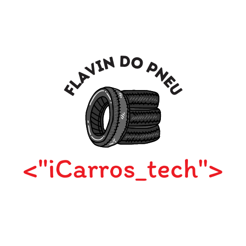

# Acelera iCarros Tech - Flavin do Pneu

## Introdução

Projeto realizado durante o [<"acelera"><"iCarros_Tech">](https://aceleraicarrostech.corporate.gama.academy/), programa de aceleração feito em parceria de [Gama Academy](https://www.gama.academy/) e o [iCarros](https://www.icarros.com.br/principal/index.jsp).

O programa consiste em dois projetos, com base no protótipo passado no [figma](https://www.figma.com/file/FnTOK15dbxgyBC2JqTMEpy/E-carros?node-id=2121%3A2407), serão construídas duas aplicações:

1. Utilizando apenas HTML, CSS e JS.
2. Utilizando React.

Este repositório contempla o projeto 1.

## Andamento

O trabalho foi divido em 13 partes, divididas nas três telas.

### Trabalho final e unificado

### Branches individuais concluídas

## Como testar o projeto

## Créditos

Projeto elaborado e planejado por:

- [Diego Sano](https://github.com/diegosano).
- [Gloria Guazzini Porte](https://github.com/gloriaporte).
- [Guilherme de Araujo Gabriel](https://github.com/guilhermag).
- [Higor Eduardo Batista](https://github.com/bhigoreduardo).
- [Yuri Cavalini](https://github.com/yuricavalini).

### Materiais utilizados

- Protótipo com ícones, imagens e planos de fundo : [Gama Academy](https://www.gama.academy/).
- Barra de progresso utilizada no README.md : [Gepser Hoil](https://github.com/gepser/markdown-progress).